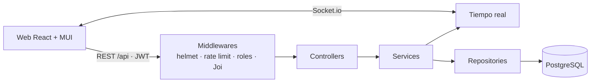

<div align="center">


**Agendamiento médico para clínicas y consultorios: pacientes, recepción y médicos en una sola agenda.**

[](https://github.com/andresazcona/HealthLeap-MONOLITH/actions/workflows/ci.yml)


[Qué incluye](#qué-incluye) · [Levantarlo](#levantarlo) · [Desplegar](#desplegar) · [API](docs/API.md) · [Cobertura](https://andresazcona.github.io/HealthLeap-MONOLITH/)

</div>

---

## Qué incluye

| Rol | Puede |
|---|---|
| **Paciente** | Crear su cuenta, buscar médicos por especialidad o nombre, ver solo horarios realmente libres, agendar, reprogramar y cancelar. |
| **Admisión** | Ver la agenda del día de todos los médicos, marcar la llegada del paciente y ver la disponibilidad de cada médico en una matriz. |
| **Médico** | Ver su sala de espera en tiempo real, atender, revisar su agenda semanal y bloquear horarios (almuerzo, reuniones). |
| **Admin** | Indicadores por estado y especialidad, gestión de médicos, usuarios y personal de recepción, reportes filtrables y exportación a CSV. |

Reglas que el sistema hace cumplir:

- El registro público **solo crea pacientes**; los demás roles los crea un admin. Nadie puede cambiar su propio rol.
- No se puede agendar ni reprogramar en el pasado, sobre otra cita del mismo médico ni en un horario bloqueado.
- Flujo de estados: `agendada` → `en espera` (admisión) → `atendida` (solo el médico de esa cita). Cancelar en cualquier momento antes.
- Cada paciente solo ve y modifica sus propias citas. Cambiar la contraseña exige la actual.
- Horario de atención 8:00–17:00 hora Colombia; todo se guarda en UTC (`TIMESTAMPTZ`) y se muestra en `America/Bogota`.

## Monorepo

```
apps/
├── api/          # Express + TypeScript + PostgreSQL (REST + Socket.io)
│   ├── src/      # routes → controllers → services → repositories
│   ├── db/       # schema.sql, seed.sql (demo), setup.js
│   └── tests/    # unit, integration (Supertest) y e2e contra Postgres real
└── web/          # React 18 + MUI v6 + TanStack Query + Vite
    └── src/      # pages por rol, components, lib (api, auth, fechas), theme
brand/            # logo, marca y app icon en SVG
docs/API.md       # contrato completo de la API
api/index.js      # entrada serverless para Vercel
Dockerfile        # imagen única: API + web
docker-compose.yml
```



## Levantarlo

### Con Docker (recomendado)

```bash
cp .env.example .env      # define JWT_SECRET, JWT_REFRESH_SECRET y el primer admin
docker compose up -d --build
```

Abre http://localhost:3000. Para probar con datos de ejemplo, pon `SEED_DEMO=true` en `.env` (solo en entornos de prueba).

### En desarrollo

Requisitos: Node.js 20+ y una base PostgreSQL (local, Docker o [Neon](https://neon.tech)).

```bash
npm install
cp apps/api/.env.example apps/api/.env   # DATABASE_URL, JWT_*, PORT=3077
npm run db:setup                          # esquema + datos de demo
npm run dev:api                           # http://localhost:3077
npm run dev:web                           # http://localhost:5190 (en otra terminal)
```

### Cuentas de demo

Solo existen si cargaste los datos de demo. Contraseña de todas: `Demo1234!`.

| Rol | Email |
|---|---|
| Admin | `admin@example.com` |
| Admisión | `admision@example.com` |
| Médico | `ana.ruiz@example.com` · `carlos.mendez@example.com` · `sofia.torres@example.com` |
| Paciente | `paciente@example.com` · `maria.lopez@example.com` |

## Desplegar

| Opción | Cómo | Tiempo real |
|---|---|---|
| **Docker** (VPS, Render, Railway, Fly) | `docker compose up -d --build` o la imagen del `Dockerfile` con un Postgres gestionado | Sí |
| **Vercel + Neon** | Importar el repo en Vercel, definir las variables de entorno y desplegar. `vercel.json` ya sirve la web y la API | No (serverless no mantiene WebSockets; el resto funciona igual) |

Variables de entorno de la API ([`apps/api/.env.example`](apps/api/.env.example)):

| Variable | Obligatoria | Descripción |
|---|---|---|
| `DATABASE_URL` | sí | Cadena de conexión PostgreSQL (`sslmode=require` activa SSL) |
| `JWT_SECRET` / `JWT_REFRESH_SECRET` | sí | Secretos largos y aleatorios |
| `EMAIL_USER` / `EMAIL_APP_PASSWORD` | sí | Cuenta para correos de confirmación y recordatorio |
| `ADMIN_EMAIL` / `ADMIN_PASSWORD` | no | Crea el primer admin al aplicar el esquema |
| `SEED_DEMO` | no | `true` carga las cuentas de demo (no usar en producción) |
| `PORT`, `CORS_ORIGIN`, `RATE_LIMIT_*` | no | Por defecto 3000, `*`, 100 req / 15 min |

## Calidad

- **147 tests unitarios** y **32 de integración** en la API.
- **E2E contra Postgres real** ([`apps/api/tests/e2e/smoke.mjs`](apps/api/tests/e2e/smoke.mjs)): flujo completo con los cuatro roles e intentos que deben fallar (horario ocupado o bloqueado, fechas pasadas, escalamiento de rol, accesos a citas ajenas).
- La CI corre todo en cada push, compila la web y publica el [reporte de cobertura](https://andresazcona.github.io/HealthLeap-MONOLITH/).

## Stack

| | |
|---|---|
| **Web** | React 18, MUI v6 (Material 3, tema propio claro/oscuro), TanStack Query, React Router, Vite |
| **API** | Node.js 20, Express 4, TypeScript 5, Joi, Socket.io, Nodemailer |
| **Datos** | PostgreSQL 16 |
| **Seguridad** | JWT, bcrypt, helmet, CORS, rate limiting, validación en cada endpoint |
| **DevOps** | Docker multi-stage, docker compose, GitHub Actions, Vercel |

---

<div align="center">
Hecho por <a href="https://github.com/andresazcona">Andrés Azcona</a>
</div>
