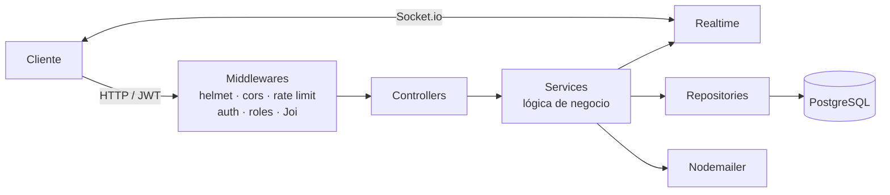

<div align="center">

# HealthLeap

**API REST para agendamiento médico: pacientes, médicos, admisión y citas en un solo backend.**

[](https://github.com/andresazcona/HealthLeap-MONOLITH/actions/workflows/ci.yml)
[](https://github.com/andresazcona/HealthLeap-MONOLITH/actions/workflows/cd.yml)


[**Reporte de tests en vivo**](https://andresazcona.github.io/HealthLeap-MONOLITH/) · [Endpoints](#api) · [Correr local](#correr-local)

</div>

---

## Qué hace

HealthLeap conecta a pacientes, médicos y personal de admisión:

- **Pacientes** buscan médicos por especialidad, ven disponibilidad y agendan, modifican o cancelan citas.
- **Médicos** configuran su agenda, bloquean horarios y marcan citas como atendidas.
- **Admisión** ve la agenda del día y marca la llegada del paciente; el médico recibe el aviso en tiempo real por WebSocket.
- **Administradores** gestionan usuarios y sacan reportes y estadísticas en JSON o CSV.

Además envía por correo confirmaciones, recordatorios y avisos de cancelación.

## Arquitectura

Monolito en capas. Cada request baja por el mismo camino y cada capa se prueba por separado.



| Capa | Carpeta | Responsabilidad |
|---|---|---|
| Rutas | `src/routes` | Define endpoints y aplica middlewares |
| Middlewares | `src/middlewares` | Autenticación JWT, roles, validación, rate limit, errores |
| Controllers | `src/controllers` | Traduce HTTP a llamadas de servicio |
| Services | `src/services` | Reglas de negocio (choques de horario, estados de cita, etc.) |
| Repositories | `src/repositories` | SQL parametrizado con `pg` |
| Realtime | `src/realtime` | Salas por médico y notificaciones Socket.io |

## Stack

| | |
|---|---|
| **Runtime** | Node.js 18, Express 4, TypeScript 5 |
| **Datos** | PostgreSQL (Neon en la nube) |
| **Seguridad** | JWT access + refresh, bcrypt, helmet, CORS, express-rate-limit, validación con Joi |
| **Tiempo real** | Socket.io |
| **Testing** | Jest, Supertest, Newman (Postman), reportes Allure |
| **DevOps** | Docker multi-stage, GitHub Actions (CI + CD a Docker Hub), SonarQube |

## Calidad

- **146 tests** unitarios en 14 suites (servicios y repositorios), más pruebas de integración y una colección Postman que se corre con Newman.
- La CI corre en cada push: lint, tests y publicación del [reporte Allure](https://andresazcona.github.io/HealthLeap-MONOLITH/) en GitHub Pages.
- La CD construye la imagen Docker y la publica en Docker Hub en cada push a `main`.

## Correr local

Requisitos: Node.js 18+ y una base PostgreSQL (local o [Neon](https://neon.tech)).

```bash
git clone https://github.com/andresazcona/HealthLeap-MONOLITH.git
cd HealthLeap-MONOLITH
npm install
cp .env.example .env   # completa DATABASE_URL, JWT_* y EMAIL_*
npm run dev            # http://localhost:3000
```

Con Docker:

```bash
cp .env.example .env
docker compose up -d --build
```

Verifica que esté arriba:

```bash
curl http://localhost:3000/health
```

### Tests

```bash
npm run test:unit         # unitarios
npm run test:integration  # integración
npm run test:coverage     # cobertura
npm run api:test          # colección Postman con Newman
```

## Variables de entorno

Todas están en [`.env.example`](.env.example). Al arrancar se validan con Joi y la app no inicia si falta alguna obligatoria.

| Variable | Obligatoria | Descripción |
|---|---|---|
| `DATABASE_URL` | sí | Cadena de conexión PostgreSQL |
| `JWT_SECRET` / `JWT_REFRESH_SECRET` | sí | Secretos para firmar tokens |
| `JWT_ACCESS_EXPIRATION` / `JWT_REFRESH_EXPIRATION` | no | Por defecto `2h` / `7d` |
| `EMAIL_USER` / `EMAIL_APP_PASSWORD` | sí | Cuenta para envío de correos |
| `EMAIL_SERVICE` / `EMAIL_FROM` | no | Por defecto `gmail` |
| `PORT` | no | Por defecto `3000` |
| `RATE_LIMIT_WINDOW_MS` / `RATE_LIMIT_MAX` | no | Por defecto 100 requests cada 15 min |

## API

Todas las rutas van bajo `/api` y, salvo registro, login y health, requieren `Authorization: Bearer <token>`.

<details>
<summary><b>Autenticación</b> · <code>/api/auth</code></summary>

| Método | Ruta | Descripción |
|---|---|---|
| POST | `/register` | Registro de usuario |
| POST | `/login` | Inicio de sesión, devuelve access y refresh token |
| POST | `/refresh-token` | Renueva el access token |
| POST | `/logout` | Cierra sesión |
| POST | `/forgot-password` | Solicita recuperación de contraseña |
| POST | `/reset-password` | Restablece la contraseña |
</details>

<details>
<summary><b>Médicos</b> · <code>/api/medicos</code></summary>

| Método | Ruta | Descripción |
|---|---|---|
| GET | `/` | Listar médicos |
| GET | `/especialidades` | Listar especialidades |
| GET | `/buscar` | Buscar por filtros |
| GET | `/perfil` | Perfil del médico autenticado |
| GET | `/:id` | Detalle de un médico |
| POST | `/` | Crear médico (admin) |
| POST | `/completo` | Crear usuario + médico en un paso (admin) |
| PATCH | `/perfil` | Actualizar perfil propio |
| PATCH | `/:id` | Actualizar médico (admin) |
| DELETE | `/:id` | Eliminar médico (admin) |
</details>

<details>
<summary><b>Citas</b> · <code>/api/citas</code></summary>

| Método | Ruta | Descripción |
|---|---|---|
| GET | `/` | Todas las citas (admin) |
| GET | `/mis-citas` | Citas del usuario autenticado |
| GET | `/filtrar` | Filtrar por criterios |
| GET | `/medico/agenda` | Agenda del médico |
| GET | `/agenda-diaria` | Agenda del día (admisión) |
| GET | `/:id` | Detalle de una cita |
| POST | `/` | Agendar cita |
| PUT | `/:id` | Modificar cita |
| PATCH | `/:id/estado` | Cambiar estado |
| PATCH | `/:id/en-espera` | Marcar llegada del paciente (admisión) |
| PATCH | `/:id/atendida` | Marcar como atendida (médico) |
| PATCH | `/:id/cancelar` | Cancelar cita |
| DELETE | `/:id` | Eliminar cita |
</details>

<details>
<summary><b>Disponibilidad</b> · <code>/api/disponibilidad</code></summary>

| Método | Ruta | Descripción |
|---|---|---|
| GET | `/` | Disponibilidad del médico autenticado |
| GET | `/medico/:medicoId/fecha/:fecha` | Consultar horarios libres |
| GET | `/agenda-completa/:fecha` | Agenda completa del día |
| POST | `/bloquear` | Bloquear horarios (médico) |
| DELETE | `/medico/:medicoId/fecha/:fecha` | Cerrar agenda del día (médico) |
</details>

<details>
<summary><b>Admisión, usuarios, reportes y notificaciones</b></summary>

| Método | Ruta | Descripción |
|---|---|---|
| GET / POST / PUT / DELETE | `/api/admision[/:id]` | CRUD de personal de admisión |
| GET | `/api/admision/perfil` | Perfil propio |
| GET | `/api/admision/areas` | Áreas de admisión |
| GET / PATCH | `/api/usuarios/me` | Perfil del usuario autenticado |
| GET / POST / PUT / DELETE | `/api/usuarios[/:id]` | CRUD de usuarios (admin) |
| GET | `/api/reportes/citas` | Reporte de citas (JSON) |
| GET | `/api/reportes/citas/csv` | Reporte de citas (CSV) |
| GET | `/api/reportes/resumen` | Resumen y estadísticas |
| GET | `/api/reportes/mis-citas` | Reporte del médico autenticado |
| POST | `/api/notify/cita-confirmacion/:citaId` | Correo de confirmación |
| POST | `/api/notify/cita-recordatorio/:citaId` | Correo de recordatorio |
| POST | `/api/notify/recordatorios-masivos` | Recordatorios masivos |
| GET | `/api/health` | Estado del servicio |
</details>

## Estructura

```
src/
├── config/         # entorno (validado con Joi), base de datos, email
├── controllers/
├── middlewares/    # authenticate, authorize, validateSchema, rateLimiter, errorHandler
├── models/
├── realtime/       # Socket.io
├── repositories/
├── routes/
├── services/
├── utils/
├── validators/
├── app.ts
└── server.ts
tests/
├── services/  repositories/  integration/
└── postman/        # colección Newman
```

---

<div align="center">
Hecho por <a href="https://github.com/andresazcona">Andrés Azcona</a>
</div>
